<div align="center">
  
  <br />
  
  <br />
  <br />
  <a href="https://niharm.me/"></a>
  <a href="mailto:nihar.manchikalapudi@gmail.com"></a>
  <a href="https://www.linkedin.com/in/nihar-manchikalapudi-3bba1b320/"></a>
</div>

---

## About Me

<table>
  <tr>
    <td width="33%">
      <h3 align="center">Build</h3>
      <p align="center">I enjoy turning rough ideas into useful, working products.</p>
    </td>
    <td width="33%">
      <h3 align="center">Experiment</h3>
      <p align="center">I like robotics, apps, AI, data, and systems that respond to real input.</p>
    </td>
    <td width="33%">
      <h3 align="center">Polish</h3>
      <p align="center">I care about clean interfaces, readable code, and strong demos.</p>
    </td>
  </tr>
</table>

## Toolbox

<div align="center">
  
</div>

## What I Care About

```txt
Robotics        -> motion, autonomy, controls, competition-ready systems
Apps + UX       -> clean flows, polished interfaces, useful student tools
AI + Data       -> practical intelligence, automation, experiments
Engineering     -> fast iteration, readable code, reliable demos
```

## Direction

I am building toward projects that combine hardware, software, and intelligent feedback. The goal is simple: make technology feel more responsive, useful, and human.
