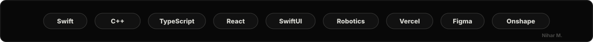

<div align="center">
  
  <br />
  
  <br />
  <br />
  <a href="https://niharm.me/"></a>
  <a href="mailto:nihar.manchikalapudi@gmail.com"></a>
  <a href="https://www.linkedin.com/in/nihar-manchikalapudi-3bba1b320/"></a>
</div>

---

## About Me

<table>
  <tr>
    <td width="33%">
      <h3 align="center">Build</h3>
      <p align="center">I enjoy turning rough ideas into useful, working products.</p>
    </td>
    <td width="33%">
      <h3 align="center">Experiment</h3>
      <p align="center">I like robotics, apps, AI, data, and systems that respond to real input.</p>
    </td>
    <td width="33%">
      <h3 align="center">Polish</h3>
      <p align="center">I care about clean interfaces, readable code, and strong demos.</p>
    </td>
  </tr>
</table>

## Toolbox

<div align="center">
  
</div>

## Build Log

<div align="center">
  <sub>A live record of the work, from first commit to now.</sub>
  <br />
  <br />
  <a href="https://commit-history.com/niharnm">
    <picture>
      <source media="(prefers-color-scheme: dark)" srcset="https://wsrv.nl/?url=commit-history.com%2Fembed%2Fniharnm%3Ftheme%3Ddark%26metric%3Dcommits%26v%3D2026-08&amp;filt=duotone&amp;start=080808&amp;stop=f4f4f1&amp;mod=1.6&amp;output=png&amp;maxage=1d" />
      
    </picture>
  </a>
</div>

## What I Care About

```txt
Robotics        -> motion, autonomy, controls, competition-ready systems
Apps + UX       -> clean flows, polished interfaces, useful student tools
AI + Data       -> practical intelligence, automation, experiments
Engineering     -> fast iteration, readable code, reliable demos
```

## Direction

I like to work on projects that interest me, reach out to me for any inquiries. 
